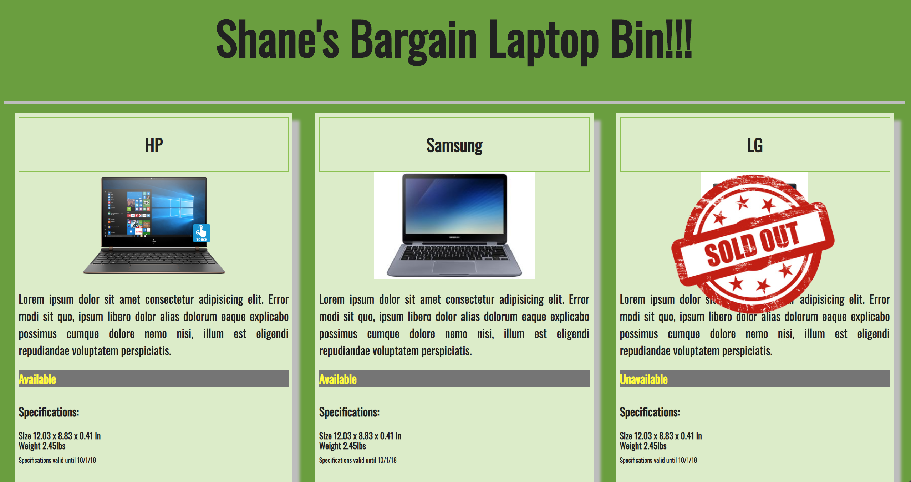
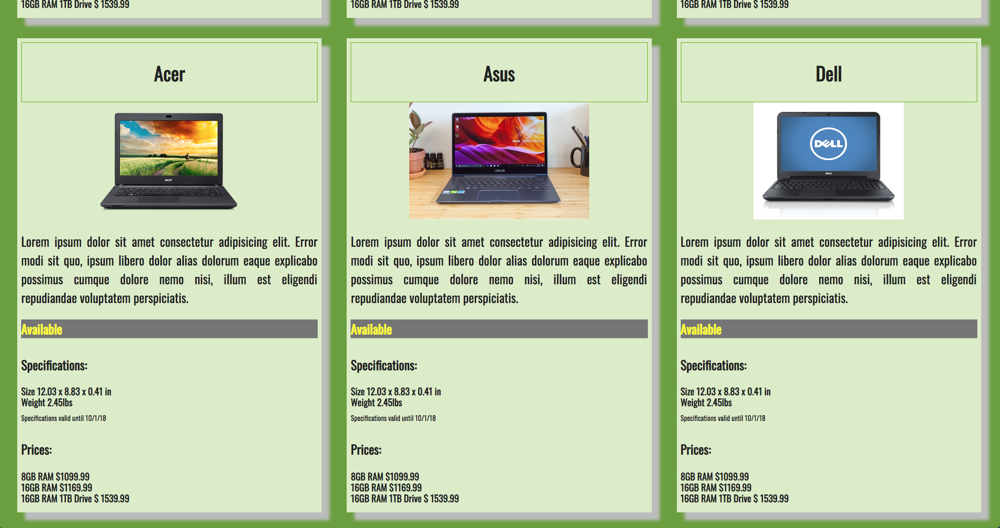

# Product Cards

This assignment was to build a grid of cards for a company's products.

Requirements were as follows:

1. Each card should be a div.
2. Cards should be 3 per row.
3. Each product should contain a header element that, itself, contains an h2 element where the product's title will be written.
4. Each product should have three block level html elements.
5. The first section should contain three child block elements.
  1. The first element contains the product image.
  2. The second element contains the product description.
  3. The third element contains the product availability (e.g. "Available" or "Not Available")
6. The second section contains product specifications.
  1. This section should have a header containing the word "Specifications"
  2. This section should contain two block elements
  3. The first block element specifies the size.
  4. The second block element specifies the weight.
  5. This section should contain a footer.
  6. The footer contains text stating when the product specifications become invalid.
7. The third section contains the product pricing.
  1. This section should contain a header.
  2. This section should contain three block elements.
  3. Each block element contains information about the price for different quantities.

### Additional style requirements
1. The entire card has a box shadow.
2. The card title has a solid 1px border that is lightblue.
3. The title and product image are centered.
4. Notice that the text for the description in the image is justified.
5. The text for the product specification details and pricing details is bold.
6. The availability element extends the full width of the card, with a dark grey background and yellow text.

Extra credit tasks included using a pallete making site for color choices, selecting a font family, adding a sold out image to an item and using media queries to make the site work on mulitple screens.

##Screenshots




## How to run this project:

* Use nmp to install htpp-server:

```sh

npm install -g http-server

```
* Run the server:

```sh

hs -p 9999

```

* Open Chrome and navigate to:

```

localhost:9999

```
